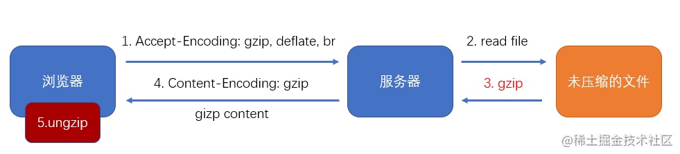
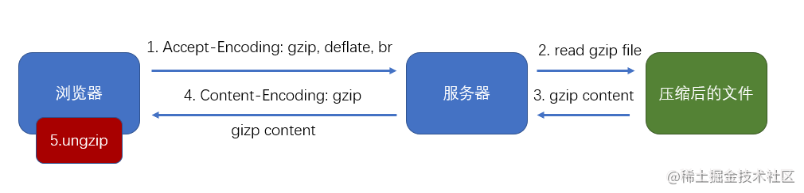
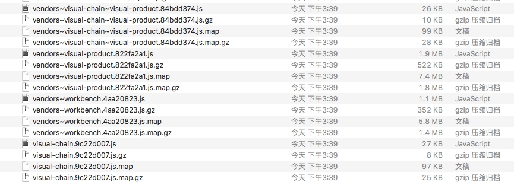
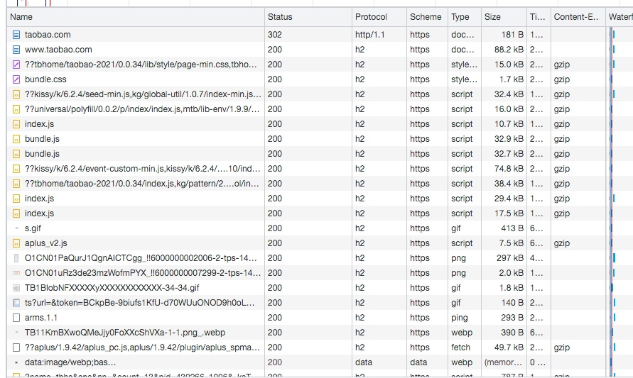

## 什么是gzip
Gzip是一种无损压缩文件的算法，简单讲，在一个文本文件中找出相似的字符串，并临时替换他们，使整个文件变小，重复度越高的文件可压缩的空间就越大。可通过浏览器请求头的Accept-Encoding是否含有gzip，查看浏览器是否支持gzip压缩（兼容所有浏览器）。
## gzip的工作流程
1.浏览器发送请求到服务端，服务端根据请求头中的Accept-Encoding字段判断改浏览器是否支持gzip压缩，如果不支持，则只相应未经压缩的资源即可；如果支持，则进入后续流程.<br>
  1）：服务端根据接口路径，读取存储在服务器的原始的未经压缩的静态资源，然后在内存中对其进行Gzip压缩，并给浏览器返回压缩后的文件（response header里Content-Encoding:gzip）
  
  此方案在每一次响应一个静态资源时，都需要将其读进内存并gzip压缩，服务器压力大
  2）：前端使用webpack配合compression-webpack-plugin在打包阶段对静态资源进行预压缩。服务器端根据接口路径，读取服务端的被Gzip压缩后的静态资源，并返回给浏览器（resonse header里Content-Encoding:gzip）



  ```
  // vue.config.js
  const CompressionWebpackPlugin = require('compression-webpack-plugin');
  ...
  configureWebpack: config => {
    config.plugins.push(new CompressionWebpackPlugin({
      algorithm: 'gzip', // 使用gzip压缩
      test: /\.(js|css|html|jpg|png)/i, // 匹配文件名 即使配了图片 也没压缩
      filename: '[path][name].gz' // 压缩后的文件名(保持原文件名，后缀加.gz)
      // minRatio: 1, // 压缩率小于1才会压缩
      // threshold: 10240, // 对超过10k的数据压缩
      // deleteOriginalAssets: false // 是否删除未压缩的源文件，谨慎设置，如果希望提供非gzip的资源，可不设置或者设置为false（比如删除打包后的gz后还可以加载到原始资源文件）
    }))
  },
  },
  ```
此方案省去了服务端的压缩时间


静态资源gzip前后大小对比

2.浏览器接收到服务端返回的结果后，会判断响应头的Content-Encoding字段是否是gzip,如果是，则自动对其进行解压，之后再进行其他处理。


## 哪些文件需要gzip压缩
Gzip压缩支持的文件类型有text/xml、text/plain、text/css、application/javascript、application/x-javascript、application/rss+xml、text/javascript、image/tiff、image/svg+xml、application/json、application/xml。

html  淘宝为什么html没有gzip压缩
js/css
图片
## 图片需要gzip压缩吗
不要！
常见的图片文件类型（png/jpg/jpeg等）和视频文件类型（mp4/avi/wmv等）已经做了内容的压缩处理，采用gzip压缩已被压缩过的东西并不能使他更小，不仅浪费了cpu，还增大了体积（添加标头）
## 怎么开启gzip
```
// nginx.conf
#开启gzip
gzip  on;  
#低于1kb的资源不压缩 
gzip_min_length 1k;
#压缩级别1-9，越大压缩率越高，同时消耗cpu资源也越多，建议设置在5左右。 
gzip_comp_level 5; 
#需要压缩哪些响应类型的资源，多个空格隔开。不建议压缩图片.
gzip_types text/plain application/javascript application/x-javascript text/javascript text/xml text/css image/png  image/jpeg;  
#配置禁用gzip条件，支持正则。此处表示ie6及以下不启用gzip（因为ie低版本不支持）
gzip_disable "MSIE [1-6]\.";  
#是否添加“Vary: Accept-Encoding”响应头
gzip_vary on;
```

## 如何查看页面是否开启gzip
1.谷歌浏览器F12
2.在表头单机鼠标右键，Response Headers,勾选Content-Encoding

Content-Encoding一栏开启了gzip则显示gzip,没有则为空

## 缺点
压缩过程占用cpu资源，客户端解析也占据了一部分时间。平衡起来可以1kb以下的文件不要gzip压缩