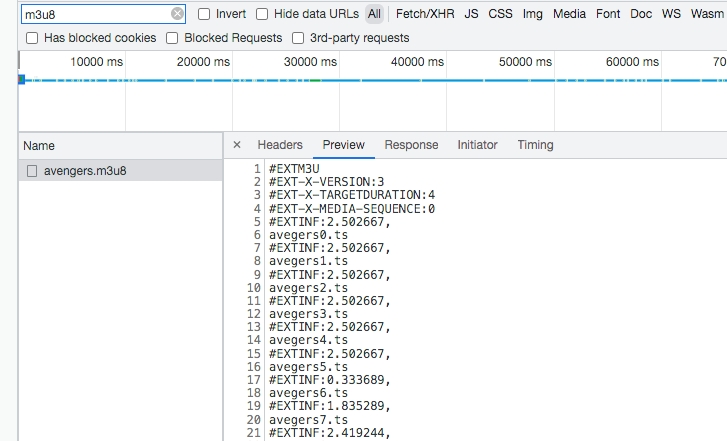

## 什么是m3u8
m3u8文件是一种基于HLS(html living scream)文件的视频格式。
HLS是一个由苹果公司提出的基于HTTP的流媒体网络传输协议。

M3U8是一种索引文件，存放整个视频的基本信息和分片组成，由一系列的ts文件组件，一般一个ts文件大概5-10s，这些ts文件通过一个m3u8文件做索引。
content-type: application/vnd.apple.mpegurl


## m3u8解决了什么问题
1）不用一次性下载整个文件，用户播放视频时，可随意拖动视频进度，会读取相应进度的ts文件继续观看视频，不必等到下载完整的视频，因此在播放m3u8视频时很好有卡顿现象。
2）可以在视频中间加广告
3）可以随时检查网络情况，让用户选择清晰度，加载不同的ts文件
## 如何播放m3u8
只有safari浏览器支持video标签直接播放m3u8格式的视频
可采用[video.js]https://github.com/video-dev/hls.js
```
var video = document.getElementById('video');
var videoSrc = './03000300006360C9B78BB7800000005D87FAB8-53E1-4572-8BB0-6B4EAF65389D.m3u8'
// video.canPlayType('application/vnd.apple.mpegurl') video标签可否直接播放m3u8格式文件
if (video.canPlayType('application/vnd.apple.mpegurl')) {
    video.src = videoSrc;
} else {
    var hls = new Hls();
    hls.loadSource(videoSrc);
    hls.attachMedia(video);
}
```
//以下是通过mediasource源码实现，使用m3u8Parser插件分析m3u8文件拿到ts文件，通过muxjs.mp4插件把ts文件转成mp4浏览器可播放的格式
```
fetchM3u8()

var playManifest = {};
function fetchM3u8() {
    var parser = new m3u8Parser.Parser();

    var m3u8url = videoSrc;
    fetch(m3u8url, {
    })
    .then(function(response) {
        return response.text();
    }).then(function(data) {
        // log('.js-log-m3u8', 'Parse "./video/index.m3u8"')
        // $('#js-code').text(data);
        parser.push(data);
        parser.end();
        playManifest = parser.manifest;
        console.log('parser', parser)
        // log('.js-log-m3u8', 'Playlist Ready')
        playSegment();
    })
}


var index = 0;
// create a transmuxer:
var transmuxer = new muxjs.mp4.Transmuxer();
var remuxedSegs = [];
var remuxedBytesLength = 0;
var remuxedInitSegment = null;
var createInitSegment = true;
var sourceBuffer;


function playSegment() {
    if (window.MediaSource) {
        var mediaSource = new MediaSource();
        video.src = URL.createObjectURL(mediaSource);
        // log('.js-log-m3u8', 'Create Media Source');
        mediaSource.addEventListener('sourceopen', sourceOpen, { once: true });
        transmuxer.on('data', function (segment) {
        remuxedSegs.push(segment);
        remuxedBytesLength =  segment.data.byteLength;
        if (!remuxedInitSegment) {
            remuxedInitSegment = segment.initSegment;
        }
        appendBuffer();
        });
    } else {
        console.log("The Media Source Extensions API is not supported.")
    }
    function sourceOpen(e) {
        URL.revokeObjectURL(video.src);
        // var mime = 'video/mp4; codecs="avc1.42c015, mp4a.40.5"';avc1.42001e"
        var mime = 'video/mp4; codecs="avc1.42E01E, mp4a.40.2"';
        var mediaSource = e.target;
        sourceBuffer = mediaSource.addSourceBuffer(mime);
        sourceBuffer.addEventListener('updateend', updateEnd);
        // var videoUrl = './video/' + playManifest.segments[index]['uri'];
        var videoUrl = 'https://events.jackpu.com/media-source/video/'+playManifest.segments[index]['uri']
        // log('.js-log-m3u8', 'Fetch Segment ~' + videoUrl);
        fetch(videoUrl, {
        })
        .then(function(response) {
        return response.arrayBuffer();
        })
        .then(function(arrayBuffer) {
        // data events signal a new fMP4 segment is ready:
        transmuxer.push(new Uint8Array(arrayBuffer));
        transmuxer.flush();
        console.log('transmuxer', transmuxer)
        // sourceBuffer.appendBuffer(arrayBuffer);
        });
    }
    function updateEnd() {
        if (!sourceBuffer.updating && mediaSource.readyState === 'open'
        && index == playManifest.segments.length - 1) {
        mediaSource.endOfStream();
        log('.js-log-m3u8', 'Start Play');
        video.play();
        return;
        }
        // Fetch the next segment of video when user starts playing the video.
        fetchNextSegment();
    }
    function fetchNextSegment() {
        index += 1;
        var url = 'https://events.jackpu.com/media-source/video/'+playManifest.segments[index]['uri'];
        fetch(url, { headers: { } })
        .then(response => response.arrayBuffer())
        .then(data => {
        // transmuxer.flush();
        transmuxer.push(new Uint8Array(data));
        transmuxer.flush();
        // var sourceBuffer = mediaSource.sourceBuffers[0];
        // sourceBuffer.appendBuffer(data);
        });
    }


    var offset = 0;
    function appendBuffer() {
        var bytes = null;
        if (createInitSegment) {
        bytes = new Uint8Array(remuxedInitSegment.byteLength + remuxedBytesLength)
        bytes.set(remuxedInitSegment, offset);
        offset += remuxedInitSegment.byteLength;
        createInitSegment = false;
        } else {
        bytes = new Uint8Array(remuxedBytesLength);
        }
        var i = offset;
        bytes.set(remuxedSegs[index].data, i);
        offset += remuxedSegs[index].byteLength;
        remuxedBytesLength = 0;
        // var sourceBuffer = mediaSource.sourceBuffers[index];
        if(index === 0) {
        // log('.js-log-m3u8', 'MSE appendBuffer');
        }
        sourceBuffer.appendBuffer(bytes);
    }
}


}
```

